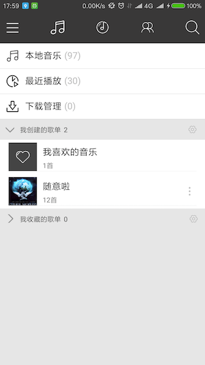
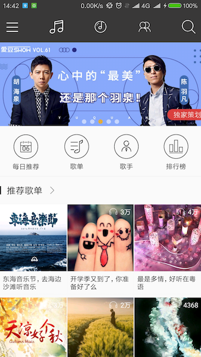
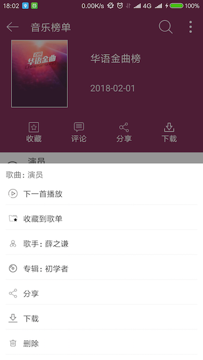
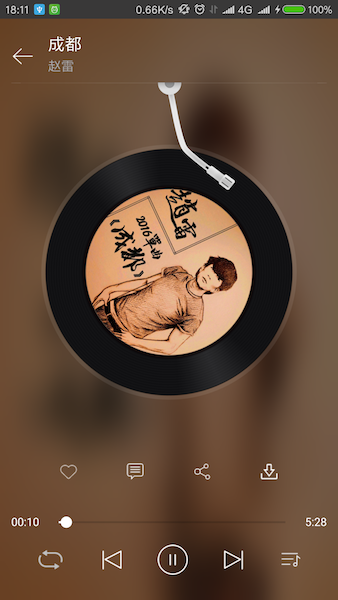
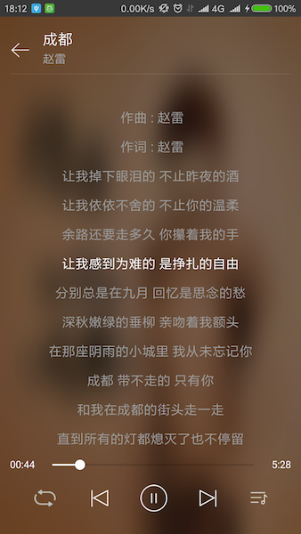
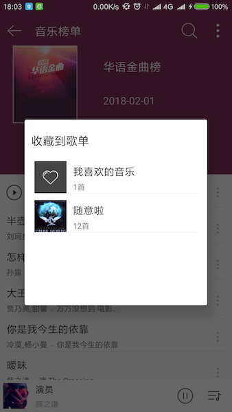

# Ez Music
EZ Music 是以 网易云音乐 为模板，使用 Kotlin 语言打造的一款 音乐播放 APP。
将会实现本地和在线音乐播放、歌单创建和管理、歌词和音乐下载等，各功能在逐步完成。

项目主体model的逻辑代码是纯 kotlin 代码，使用EventBus分发事件，虽然音乐播放器中各页面的联动很多，但使用了事件机制，
通过类似广播的方式进行页面的联动更新，降低了各页面的耦合度。

项目数据库框架：realm   
网络访问和异步框架：RxJava + RxAndroid + [OKGo](https://github.com/jeasonlzy/okhttp-OkGo)

项目中歌曲播放模块 黑胶专辑和歌词控件，引用了 Github 上开源的 [PonyMusic](https://github.com/wangchenyan/PonyMusic)，
云感谢一波~~

APP 部分界面截图：

                

          

          

                 

 